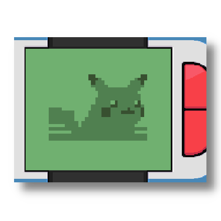
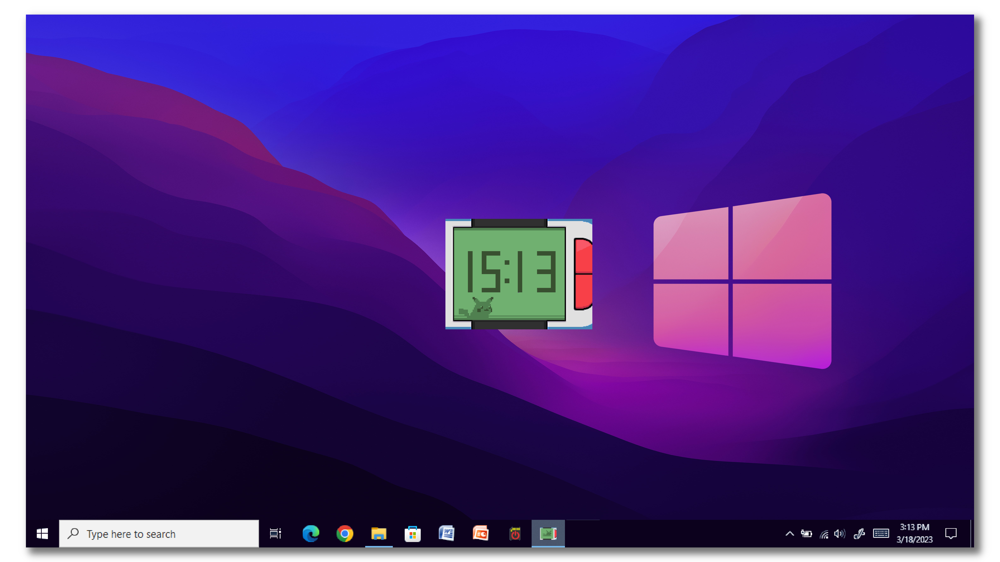

<!-- PROJECT LOGO -->
<h1 align="center">
   
  
   
  <b>Poketch</b>
   
  <b>Recreation of the Pokétch from Pokémon Diamond/Pearl/Platinum, made in Godot.</b>
   

</h1>

       Faithful remake of the Pokétch from Pokémon Diamond, Pearl and Platinum! Have
your very own Pokétch right on your desktop! This was just a fun project I worked on using Godot. I plan on to makes some 
updates that will add more Pokétch apps! This is project is ment to be a love letter to Pokémon Diamond, Pearl, and Platinum.
This is open-source, so you are free to contribute to this project :)  

<!-- ABOUT THE PROJECT -->

## Getting Started
Want your very own Poketch? You will be up and running in a minute!

### Download
1. Download the Zip file [here](https://github.com/BotRandomness/Poketch/releases), for your version of operating system
2. Extract the zip file at your desire location
3. Open the `Pokétch` Application, the application is just a single file, no installation, it just opens up!

That's it, your ready to use your own Pokétch!

### Controls
- To drag the window around, click and drag the top part of the Pokétch
- To exit the application, press the [ESC] (escape) key
- To minimize the application, press [TAB] key
- Press [1] for Pink Pokétch, Press [2] for blue Pokétch

### Pokétch Apps Included

- Recreated Apps:
  - Digtal Clock
  - Map of Sinnoh
  - Calculator
  - Memo
  - Counter
- Custom Apps (Apps Custom Made/Unused Apps From The Offical Games):
  - DummyApp00
  - DummyApp12
  - Music Player
  - Pokétch Help (A modifiy version of the Link Searcher App)
 - More Poketch apps are planned to be remade!

## Compile

Want to tinker around, modify, make your own, or contribute? Here's how you can get started with the code and compile.

This was made using **Godot**, a **free**, and **open-source game engine**. Godot is fast and lightweight, and the programming languages used, GDScript is perfect for both experience and beginners alike.
**NOTE**: This was made using **Godot 3.5.3**

1. Download Godot here: https://godotengine.org/
2. Extract the zip in your desire location, and open `Godot` application, there is no installers, it just opens up!
3. Download this repository through zip, or git, and in Godot, open the `project.godot` file
4. Once the project is open, you can do whatever you like. Then to build for whatever platform you like, head to Project > Export. It may ask you to download a export template for your target platform, if your new to Godot, but export is simple as one click. 

### Program Architechture

Heres a little bit on the program layout!  

Godot by design is object oriented, including it's programming language, GDScript. Godot uses the concept of Nodes and Scenes. Everything in Godot is a Scene, and nodes are essentially building blocks that build up a scene. A whole level is a scene, a player is a scene, even a single node can be it's own scene. I recommend reading the Getting Started guide for Godot if you are new to Godot as it's a big help to understand the basic outline of the program and how Godot works: https://docs.godotengine.org/en/stable/index.html 

With these concepts in mind, Heres an example of this works:  

The `WatchTest.tscn` scene is the main scene. It includes the main watch, and the buttons to switch apps which is controlled by the script `WatchTest_Main.gd`, placed on the parent node/main node the whole scene is built on. `WatchTest_Main.gd` controls the buttons and app switching, and can instantiate the other app scenes.

The actual app are their own scenes, like `AppMap.tscn`, is the map app. They too have their own script, like `AppMap.gd`, to do their own things.

This sort of flexibility is what makes Godot so great. It's simple to build each thing independently, then add everything together.

## Upcoming Features

- [ ] Remake more Poketch apps
  - Type match up, Alarm clock, Pokemon Team Viewer, etc
- [ ] Custom Poketch apps/Unsed Poketch apps  
- Post any feature request in the Issues tab!

## Known issues

- If app switch button is spammed, sometimes the program can get confuse to what app to switch to.
- If you find any other issues/bugs, post about it on the issues tab
  - Also provide what version your using (as well what version of Godot), and how to reproduce it

## Contributing

This project is open-source under the MIT License - Modify Non-commerical, meaning your free to do what ever you want with it (except no commerical/profit use). This project is freely available for anyone to contribute, Pokemon fans, Godot beginner or experts, or someone who is new to it all.

If you plan on contributing, a good place to start is to look at upcoming wanted features, and known issues. If you find a new bug, or have feature ideas of your own, posted first to the Issues tab before hand.  

To get started on contributing:

1. Fork or Clone the Project
2. Once you have your own repository (it can be a public repository) to work in, you can get started on what you want to do!
3. Make sure you git Add and git Commit your Changes to your repository
4. Then git push to your repository
5. Open a Pull Request in this repositroy, where your changes will be look at to be approved
6. Once it's approved, it will be in a development branch, soon to be merge to the main branch

<!-- LICENSE -->

## License

Distributed under the MIT License - Modify Non-commerical. See `LICENSE.txt` for more information.
Disclaimer: THIS PROJECT IS NOT ASSOCIATED WITH NINTENDO OR THE POKÉMON COMPANY, ALL SPRITES AND SOUNDS MUSIC BELONG TO THE POKÉMON COMPANY
